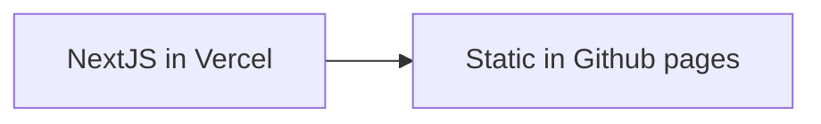
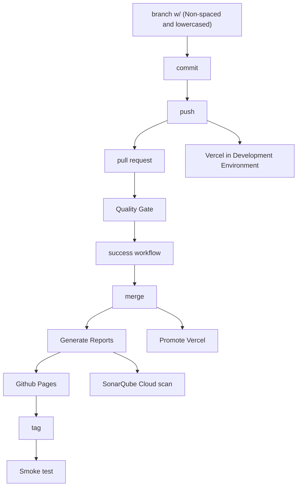

# Walcron - a personal website

[](https://github.com/yoonghan/yoonghan.github.io/actions?query=workflow%3A"Report+merged+result+on+main")
[](https://codecov.io/gh/yoonghan/yoonghan.github.io)
[](https://sonarcloud.io/summary/new_code?id=yoonghan_yoonghan.github.io)
[](https://sonarcloud.io/summary/new_code?id=yoonghan_yoonghan.github.io)
[](https://sonarcloud.io/summary/new_code?id=yoonghan_yoonghan.github.io)
[](https://sonarcloud.io/summary/new_code?id=yoonghan_yoonghan.github.io)
[](https://sonarcloud.io/summary/new_code?id=yoonghan_yoonghan.github.io)

---

A personal website for self-learning interest. We host our website in 2 locations:

- [Vercel](https://www.walcron.com)
- [Github Pages](https://yoonghan.github.io)



## How to Use

In your terminal, run the following command:

For local execution:

```bash
npm run dev
```

For test with watch

```bash
npm run test
```

For test coverage

```bash
npm run test:ci
```

For linting and prettifier check

```bash
npm run lint
```

For package analysing, do not check-in as it contains alot of security issues.

```bash
npm install @next/bundle-analyzer
# Wrap next.config.js with withBundleAnalyzer({...})
npx next build
```

For BackstopJS - regression for view and approve website design UI
**Note**: that browser executes differently in OS, especially font's. In this case use the approved generated backstopJS snapshots directly from the OS/Docker container.

```bash
npm run backstop:test  //To test
npm run backstop:approve // Approve the new website ok
```

To stop animation, append query string to use `animate-none` class

```js
?animate=none
```

## Setting environments

1. Install Vercel Cli, with `npm i -g vercel`
2. Pull all the environment into local with `vercel env pull .env.local`. This wil create an environment straight for testing. Incase, there are reset of environment to setup in Vercel, refer to .env file.

## Additional environment id in Next.JS

1. CORS_ALLOW_ORIGIN - for whitelisting /api url defined in next.config.js to external apps.
2. NEXT_PUBLIC_SITE_URL - configure for static site to call api. Overrides blank with https://www.walcron.com.
3. NEXT_PUBLIC_API_SITE_URL - Indicate local api is url.
4. NEXT_PUBLIC_GA_4_ID - Google 4 Tag Manager Ids

## Run Github workflows



In case there is a need to generate a new backstopJS approved page.

1. In github, go to _Actions_ tab.
2. Select 'Create Approved Snapshot By File'.
3. Click on 'Run workflow'
4. Enter the vercel/public website to generate an approved website domain. Without http, e.g. https:\/\/www.walcron.com to www.walcron.com
5. Manually enter a valid branch it can checkout, e.g. develop.

Updating backstopJS snapshot.

--By pull request / action

1. Download the artifacts generated in "Summary" of the latest build. Replace generated snapshot in backstop*data/bitmaps_test/*/!failed\_.png
2. replace into bitmaps_reference.

--Auto approval _(Recommended)_

1. Get the latest pipeline no from _snapshotcheck.sh_ output from previous failed _Validation_ workflow.
2. OR view latest running script in github's _Actions_ tab for _Validation_ workflow.
3. Execute the command below and it will auto-approve and rerun _Validation_ workflow again.

```
echo ${running no# +1} > backstopjs.approve
git add backstopjs.approve
git push
```

_Note:_ Add create PAT, personal profile -> Developer Settings -> Fine Grain Token -> Actions(R)/Commit Statues(RW)/Contents(RW)/Metadata(R)

## Deployment to Vercel

1. Required an NPM token for private repository. See "Deployment for Github NPM_TOKEN for private repo"
2. Login locally into github NPM repo with the PAT.

`npm login --scope=@yoonghan --auth-type=legacy --registry=https://npm.pkg.github.com/`

3. Copy in ~/.npmrc into vercel's variable NPM_RC. Basically the variable will contain:

```
//npm.pkg.github.com/:_authToken=...
@yoonghan:registry=https://npm.pkg.github.com/
```

## Deployment for Github NPM_TOKEN for private repo

1. For accessing private repo, please allow Profile -> Settings -> Personal Access Token (classic), open read:packages (basically the same as vercel deployment). For more info refer: https://docs.github.com/en/packages/working-with-a-github-packages-registry. Add as Github secret in Settings->Secrets And variable and add NPM_TOKEN key. NOTE: During npm install NODE_AUTH_TOKEN variable is read instead.
2. Workflow requires
3. registry-url in checkout action,
4. NODE_AUTH_TOKEN env. If the workflow is callable, use "secrets: inherit", else secret cannot be shown. To test print with `echo ${#NODE_AUTH_TOKEN}` and should return some integer values.
5. Same/extra NPM_TOKEN needs to be created for dependabot under Profile -> Security -> Dependabot.

## Vercel/NextJS

1. NextJS on vercel re-uses .next build cache. This sometimes creates an issue, e.g. a page that was once deployed as AMP will forever be recognized as AMP until the cache is cleared.
2. To build without previous build cache; click redeploy button from Vercel dashboard (a menu from the 3 vertical dots) and uncheck "Build with previous build cache".

## NextJS Static Site Generation

NextJS for static generation `output: "export"` in `next.config.js`, requires all pages to have removed `"use server"`. Generally all pages that requires _/api_ call needs to be removed as well.

Process.env variable for client side access are required to be defined in .env file (written in merge.yml)

| Key                        | Description                                             |
| -------------------------- | ------------------------------------------------------- |
| NEXT_PUBLIC_PUSHER_APP_KEY | Public key for pusher API to access pusher              |
| NEXT_PUBLIC_PUSHER_CLUSTER | Public pusher API cluster region                        |
| NEXT_PUBLIC_SITE_URL       | URL to hosted url for content metadata (i.e. canonical) |
| NEXT_PUBLIC_API_SITE_URL   | URL to hosted api url, i.e. https://www.walcron.com/api |

## Rust Webassembly

1. To regenerate new Wasm from webassembly, run the command below:
2. The scripts include a custom .gitignore.
3. Incase wanted to run rust:test, remove --headless and browse with https://localhost:8000. Failed to run it in MacOS.

```
npm run rust:generate
npm run rust:test //test rust running on browser
```

## Opentelemetry view

1. Set variables configured in axiom to view telemetry AXIOM_API_TOKEN and AXIOM_DATASET_NAME.
2. To show open telemetry logs, run OTEL_LOG_LEVEL=debug.

## Using Vibe code.

Adding Gemini capabilities to understand the project. Instructions are added into Gemini.md.